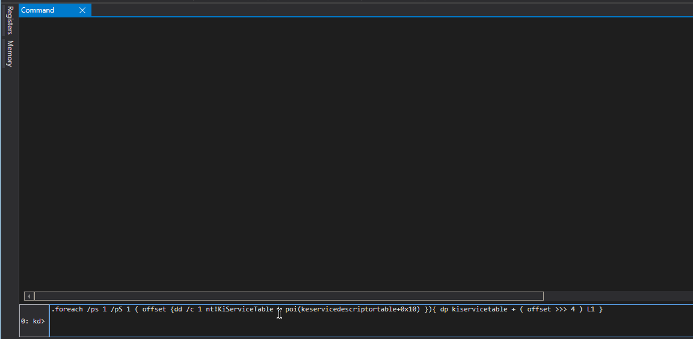

# A Glimpse into SSDT inside Windows x64 Kernel

## What is SSDT

System Service Dispatch Table or SSDT, simply is an array of addresses to kernel routines for 32 bit operating systems or an array of relative offsets to the same routines for 64 bit operating systems. 

SSDT is the first member of the Service Descriptor Table kernel memory structure as shown below:

```cpp
typedef struct tagSERVICE_DESCRIPTOR_TABLE {
    SYSTEM_SERVICE_TABLE nt; //effectively a pointer to Service Dispatch Table (SSDT) itself
    SYSTEM_SERVICE_TABLE win32k;
    SYSTEM_SERVICE_TABLE sst3; //pointer to a memory address that contains how many routines are defined in the table
    SYSTEM_SERVICE_TABLE sst4;
} SERVICE_DESCRIPTOR_TABLE;
```


SSDTs used to be hooked by AVs as well as rootkits that wanted to hide files, registry keys, network connections, etc. Microsoft introduced PatchGuard for x64 systems to fight SSDT modifications by BSOD'ing the system.


## In Human Terms

When a program in user space calls a function, say `CreateFile`, eventually code execution is transfered to `ntdll!NtCreateFile` and via a **syscall** to the kernel routine `nt!NtCreateFile`.

Syscall is merely an index in the System Service Dispatch Table \(SSDT\) which contains an array of pointers for 32 bit OS'es \(or relative offsets to the Service Dispatch Table for 64 bit OSes\) to all critical system APIs like `ZwCreateFile`,  `ZwOpenFile` and so on..

Below is a simplified diagram that shows how offsets in SSDT `KiServiceTable`  are converted to absolute addresses of corresponding kernel routines:


Effectively, syscalls and SSDT \(`KiServiceTable`\) work togeher as a bridge between userland API calls and their corresponding kernel routines, allowing the kernel to know which routine should be executed for a given syscall that originated in the user space.

## Service Descriptor Table

In WinDBG, we can check the Service Descriptor Table structure `KeServiceDescriptorTable` as shown below. Note that the first member is recognized as `KiServiceTable` - this is a pointer to the SSDT itself - the dispatch table \(or simply an array\) containing all those pointers/offsets:

```erlang
0: kd> dps nt!keservicedescriptortable L4
fffff801`9210b880  fffff801`9203b470 nt!KiServiceTable
fffff801`9210b888  00000000`00000000
fffff801`9210b890  00000000`000001ce
fffff801`9210b898  fffff801`9203bbac nt!KiArgumentTable
```

Let's try and print out a couple of values from the SSDT:

```erlang
0: kd> dd /c1 KiServiceTable L2
fffff801`9203b470  fd9007c4
fffff801`9203b474  fcb485c0
```

As mentioned earlier, on x64 which is what I'm running in my lab, SSDT contains relative offsets to kernel routines. In order to get the absolute address for a given offset, the following formula needs to be applied:

$$
RoutineAbsoluteAddress = KiServiceTableAddress + (routineOffset >>> 4)
$$

Using the above formula and the first offset `fd9007c4` we got from the `KiServiceTable`, we can work out that this offset is pointing to `nt!NtAccessCheck`:

```erlang
0: kd> u KiServiceTable + (0xfd9007c4 >>> 4)
nt!NtAccessCheck:
fffff801`91dcb4ec 4c8bdc          mov     r11,rsp
fffff801`91dcb4ef 4883ec68        sub     rsp,68h
fffff801`91dcb4f3 488b8424a8000000 mov     rax,qword ptr [rsp+0A8h]
fffff801`91dcb4fb 4533d2          xor     r10d,r10d
```

We can confirm it if we try to disassemble the `nt!NtAccessCheck` - routine addresses \(fffff801\`91dcb4ec\) and first instructions \(mov r11, rsp\) of the above and below commands match:

```erlang
0: kd> u nt!NtAccessCheck L1
nt!NtAccessCheck:
fffff801`91dcb4ec 4c8bdc          mov     r11,rsp
```


If we refer back to the original drawing on how SSDT offsets are converted to absolute addresses, we can redraw it with specific values for syscall 0x1:


## Finding a Dispatch Routine for a Given Userland Syscall

As a simple exercise, given a known syscall number, we can try to work out what kernel routine will be called once that syscall is issued. Let's load the debugging symbols for `ntdll` module:

```erlang
.reload /f ntdll.dll
lm ntdll
```


Let's now find the syscall for `ntdll!NtCreateFile`: 

```erlang
0: kd> u ntdll!ntcreatefile L2
```

...we can see the syscall is 0x55:


Offsets in the `KiServiceTable` are 4 bytes in size, so we can work out the offset for syscall 0x55 by looking into the value the `KiServiceTable` holds at position 0x55:

```erlang
0: kd> dd /c1 kiservicetable+4*0x55 L1
fffff801`9203b5c4  01fa3007
```

We see from the above that the offset for `NtCreateFile` is `01fa3007`. Using the formula discussed previously for working out the absolute routine address, we confirm that we're looking at the `nt!tCreateFile` kernel routine that will be called once `ntdll!NtCreateFile` issues the 0x55 syscall:

```erlang
0: kd> u kiservicetable + (01fa3007>>>4) L1
nt!NtCreateFile:
fffff801`92235770 4881ec88000000  sub     rsp,88h
```

Let's redraw the earlier diagram once more for the syscall 0x55 for `ntdll!NtCreateFile`:


## Finding Address of All SSDT Routines

As another exercise, we could loop through all items in the service dispatch table and print absolute addresses for all routines defined in the dispatch table:

```erlang
.foreach /ps 1 /pS 1 ( offset {dd /c 1 nt!KiServiceTable L poi(keservicedescriptortable+0x10) }){ dp kiservicetable + ( offset >>> 4 ) L1 }
```



Nice, but not very human readable. We can update the loop a bit and print out the API names associated with those absolute addresses:

```erlang
0: kd> .foreach /ps 1 /pS 1 ( offset {dd /c 1 nt!KiServiceTable L poi(nt!KeServiceDescriptorTable+10)}){ r $t0 = ( offset >>> 4) + nt!KiServiceTable; .printf "%p - %y\n", $t0, $t0 }
fffff80191dcb4ec - nt!NtAccessCheck (fffff801`91dcb4ec)
fffff80191cefccc - nt!NtWorkerFactoryWorkerReady (fffff801`91cefccc)
fffff8019218df1c - nt!NtAcceptConnectPort (fffff801`9218df1c)
fffff801923f8848 - nt!NtMapUserPhysicalPagesScatter (fffff801`923f8848)
fffff801921afc10 - nt!NtWaitForSingleObject (fffff801`921afc10)
fffff80191e54010 - nt!NtCallbackReturn (fffff801`91e54010)
fffff8019213cf60 - nt!NtReadFile (fffff801`9213cf60)
fffff801921b2e80 - nt!NtDeviceIoControlFile (fffff801`921b2e80)
fffff80192212dc0 - nt!NtWriteFile (fffff801`92212dc0)
.....cut for brewity.....
```

## References







