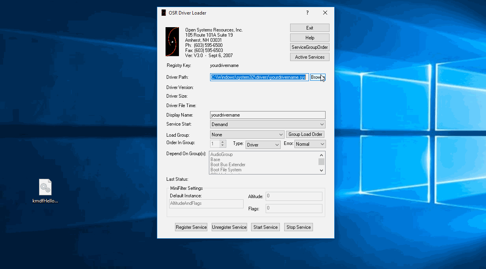

# Loading a Windows Kernel Driver to Windows 10

## Loading a Driver

On the system where you want to load your driver \(debugee\), from an elevated command prompt, disable the driver integrity checks so that we can load our unsigned drivers onto Windows 10:

```text
bcdedit.exe /set nointegritychecks on
```


Once you have rebooted the system, open up the [OSR Loader](https://www.osronline.com/article.cfm%5Earticle=157.htm) and load the driver as shown below:



Note that my driver name was `kmdfHelloDriver`. We can now confirm the driver loaded successfully by debugging the kernel:

```text
0: kd> db kmdfHelloDriver
```


Additionally, we can check it this way by showing some basic details about the loaded module:

```text
0: kd> ln kmdfHelloDriver
```


If we check it via the service configuration manager, we also see that our driver is now loaded and running:

```text
sc.exe query kmdfHelloDriver
```


