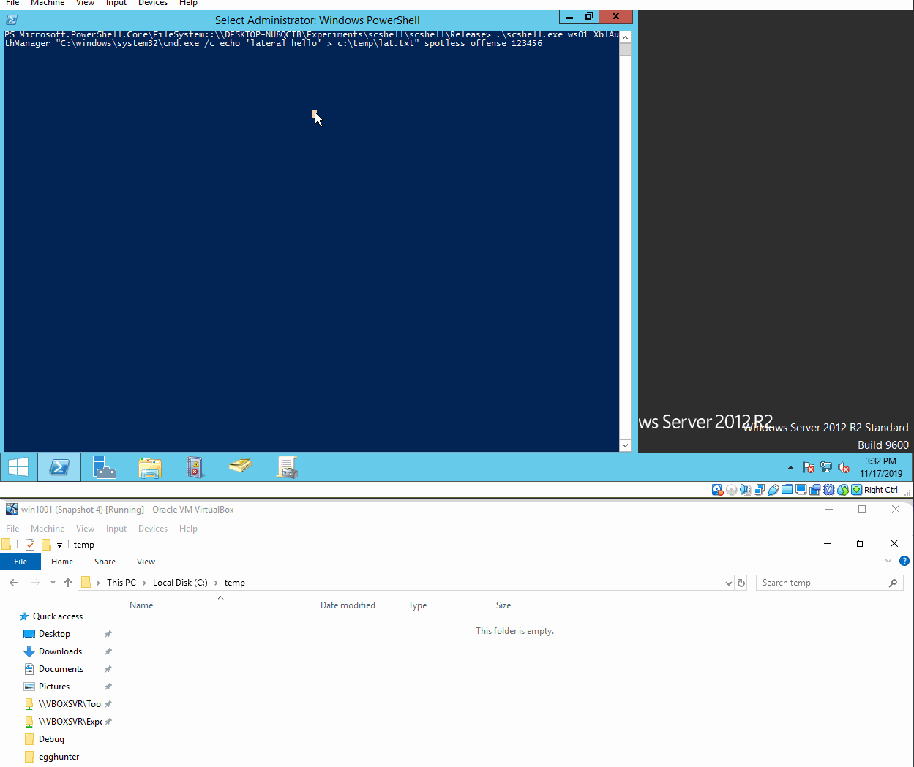

# Lateral Movement Abusing Service Configuration Manager

It's possible to execute commands on a remote host by abusing service configuration manager by changing the service binpath to your malicious command and restarting the service so your payload gets executed - this is all automated by a nice tool [SCShell](https://github.com/Mr-Un1k0d3r/SCShell)

## Execution

Scshell expects the following arguments: target, service, payload, username, domain, password:



```text
.\scshell.exe ws01 XblAuthManager "C:\windows\system32\cmd.exe /c echo 'lateral hello' > c:\temp\lat.txt" spotless offense 123456
```





## Considerations

From the defensive side, you may want to consider about monitoring services that change their binPaths "too often" as this may not be normal in your environment, especially if the binPath is "very" different \([Levenshtein](https://www.google.com/search?q=levenshtein+distance&oq=levensht&aqs=chrome.1.69i57j0l5.2647j0j7&sourceid=chrome&ie=UTF-8)\) to the previously known good value and if the service configuration is being changed over the network:


## References



